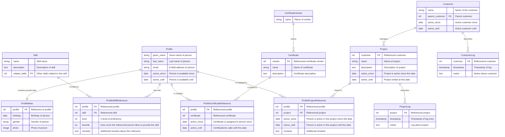

# Skills manager

Management of skills, certificates and projects for consulting companies.

# Database design

```mermaid
erDiagram
	direction TB
	Profile {
		string given_name  "Given name of person"  
		string last_name  "Last name of person"  
		string email  "E-Mail address of person"  
		date active_since  "Person is available since"  
		date active_until  "Person is available until"  
	}

	ProfileMeta {
		ref profile FK "Reference to profile"  
		date birthday  "Birthday of person"  
		string gender  "Gender of person"  
		image photo  "Photo of person"  
	}

	Skill {
		string name  "Skill name"  
		text description  "Description of skill"  
		ref related_skills FK "Other skills related to this skill"  
	}

	ProfileSkillReference {
		ref profile FK "Referenced profile"  
		ref skill FK "Referenced skill"  
		int level  "A level of proficiency"  
		int favorite  "How much the referenced person likes to provide the skill"  
		text remarks  "Additional remarks about this reference"  
	}

	CertificateVendor {
		string name  "Name of vendor"  
	}

	Certificate {
		ref vendor FK "Referenced certificate vendor"  
		string name  "Name of certificate"  
		text description  "Certificate description"  
	}

	ProfileCertificateReference {
		ref profile FK "Referenced profile"  
		ref certificate  "Referenced certificate"  
		date active_since  "Certificate is assigned to person since"  
		date active_until  "Certificationis valid until this date"  
	}

	Customer {
		string name  "Name of the customer"  
		ref parent_customer FK "Parent customer"  
		date active_since  "Active customer since"  
		date active_until  "Active customer until"  
	}

	Project {
		ref customer FK "Referenced customer"  
		string name  "Name of project"  
		text description  "Description of project"  
		date active_since  "Project is active since this date"  
		date active_until  "Project ended at this date"  
	}

	ProfileProjectReference {
		ref profile FK "Referenced profile"  
		ref project FK "Referenced project"  
		date active_since  "Person is active in this project since this date"  
		date active_until  "Person is active in this project until this date"  
		text remarks  "Additional remarks"  
	}

	ProjectLog {
		ref project FK "Referenced project"  
		timestamp timestamp  "Timestamp of log entry"  
		text notice  "Log about project"  
	}

	CustomerLog {
		ref customer FK "Referenced customer"  
		timestamp timestamp  "Timestamp of log"  
		text notice  "Notice about customer"  
	}

	Profile||--||ProfileMeta:"contains private data"
	Profile||--o{ProfileSkillReference:"has skill"
	Skill||--o{ProfileSkillReference:"is linked to"
	CertificateVendor||--o{Certificate:"issues"
	Certificate||--o{ProfileCertificateReference:"is linked to"
	Profile||--o{ProfileCertificateReference:"is certified"
	Customer||--o{Project:"manages"
	Project||--o{ProfileProjectReference:"linked to"
	Profile||--o{ProfileProjectReference:"is engaged in"
	Customer||--o{CustomerLog:"describes"
	Project||--o{ProjectLog:"describes"


```