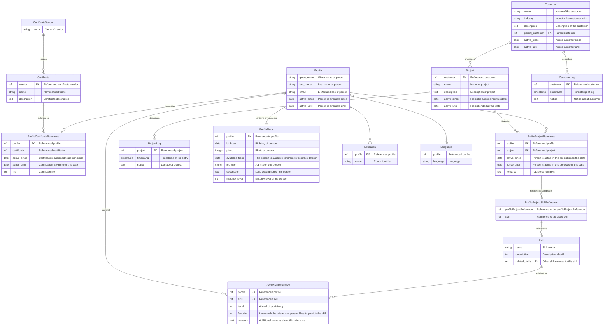

# Skills manager


Management of skills, certificates and projects for consulting companies.


# Installation

## Docker/Container deployment

Start the container with the [configured environment variables](#configuration) and expose the port 8000, e.g. with podman:

    podman run --rm -it -e DEBUG=true -e DJANGO_SUPERUSER_USERNAME=app -e DJANGO_SUPERUSER_PASSWORD=admin -e DJANGO_SUPERUSER_EMAIL=admin@company.com -e SECRET_KEY=verysecret -P ghcr.io/devobagmbh/skillsmanager:latest

## Python native

Create a venv locally and activate it:

    python -m venv .venv
	. .venv/bin/activate

Install the requirements:

    pip -r requirements.txt

Set the required environment variables (see [below](#configuration)).

    export SECRET_KEY=secret

Initialize the database

    python manage.py migrate

Create a superuser

    python manage.py createsuperuser

For local testing, use 

    python manage.py runserver

For production deployment, use one of the recommended techniques as described in the [Django documentation](https://docs.djangoproject.com/en/5.2/howto/deployment/).

# Configuration

Skills manager is configured using the following environment variables:

* DATABASE_URL: Database configuration for Django. See [the dj-database-url documentation](https://pypi.org/project/dj-database-url/) for details
* SECRET_KEY: The Django secret key
* APPLICATION_HOST: Host the application runs on (e.g. skills.company.com). Required if DEBUG is not set to true.
* DEBUG: Whether to run the application in Django debug mode [False]
* AZURE_ENABLED: Whether login via Azure entra id is enabled. See [the django-azure-auth documentation](https://pypi.org/project/django-azure-auth/) for details
* AZURE_CLIENT_ID: Azure client id
* AZURE_CLIENT_SECRET: Azure client secret
* AZURE_TENANT_ID: Azure tenant id
* AZURE_PROMPT: Whether to just accept the login (`none`) force to user to `login`, `consent` again or select an account (`select_account`) [none]
* AZURE_ROLES: Role to Django group mapping in JSON form. e.g.:
```json
{
        "95170e67-2bbf-4e3e-a4d7-e7e5829fe7a7": "GroupName1", # mapped to one Django group
        "3dc6539e-0589-4663-b782-fef100d839aa": ["GroupName2", "GroupName3"] # mapped to multiple Django groups
}
```

# Usage

## CV generator

Skills Manager can generate CV as PDF files from the data contained in the database. This is done by rendering a [Jinja HTML Template](https://docs.djangoproject.com/en/5.2/ref/templates/language/) using [Weasyprint](https://weasyprint.org/). Multiple templates are supported.

### Available data

Skills Manager supplies templates with a template context that includes data from multiple models. See the [model source code](skillsManager/models.py) on what fields are available. Fields from relationships are also available using a dot syntax. (e.g. `certificates.vendor.name`).

* profile: The `Profile` model from the selected profile
* profile_meta: The `ProfileMeta` model associated with the selected profile
* languages: A list of `Language` models associated with the selected profile
* educations: A list of `Education` models associated with the selected profile
* certificates: A list of `Certificate` models associated with the selected profile
* project_works: A list of of objects of projects the profile worked on with the following fields:
  * project_work: The associated `ProfileProjectReference` model - details about the work
  * skills: a list of `ProfileProjectSkillReference` models associated with the project work - skills used during this
* skills: A list of `ProfileSkillReference` models associated with the selected profile, sorted by level descending

### Markdown support

Markdown support is available provided by [django-markdownify](https://github.com/erwinmatijsen/django-markdownify) by including

    

at the top of the template and then using the markdownify pipe to render a text as html:

    

# Development

## Database design

